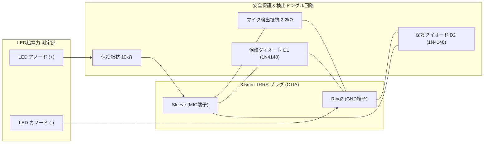

```mermaid

graph LR
    subgraph LED_Board ["LED起電力 測定部"]
        LED_Anode["LED アノード (+)"]
        LED_Cathode["LED カソード (-)"]
    end

    subgraph Dongle_Circuit ["安全保護＆検出ドングル回路"]
        R_Protect["保護抵抗 10kΩ"]
        R_Detect["マイク検出抵抗 2.2kΩ"]
        D1["保護ダイオード D1 (1N4148)"]
        D2["保護ダイオード D2 (1N4148)"]
    end

    subgraph TRRS_Plug ["3.5mm TRRS プラグ (CTIA)"]
        MIC["Sleeve (MIC端子)"]
        GND["Ring2 (GND端子)"]
    end

    %% 配線接続
    LED_Anode --> R_Protect
    R_Protect --> MIC
    
    LED_Cathode --> GND

    %% 検出抵抗・保護ダイオード（並列接続）
    MIC --- R_Detect --- GND
    MIC --- D1 --- GND
    GND --- D2 --- MIC
```