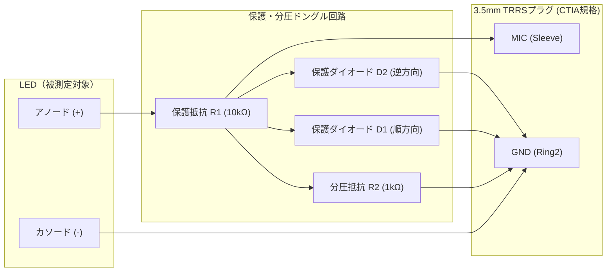

```mermaid

flowchart LR
    subgraph LED_Side ["LED（被測定対象）"]
        A_Anode["アノード (+)"]
        A_Cathode["カソード (-)"]
    end

    subgraph Dongle ["保護・分圧ドングル回路"]
        R1["保護抵抗 R1 (10kΩ)"]
        R2["分圧抵抗 R2 (1kΩ)"]
        D1["保護ダイオード D1 (順方向)"]
        D2["保護ダイオード D2 (逆方向)"]
    end

    subgraph TRRS_Plug ["3.5mm TRRSプラグ (CTIA規格)"]
        MIC["MIC (Sleeve)"]
        GND["GND (Ring2)"]
    end

    A_Anode --> R1
    R1 --> R2
    R1 --> D1
    R1 --> D2
    R1 --> MIC

    A_Cathode --> GND
    R2 --> GND
    D1 --> GND
    D2 --> GND

```